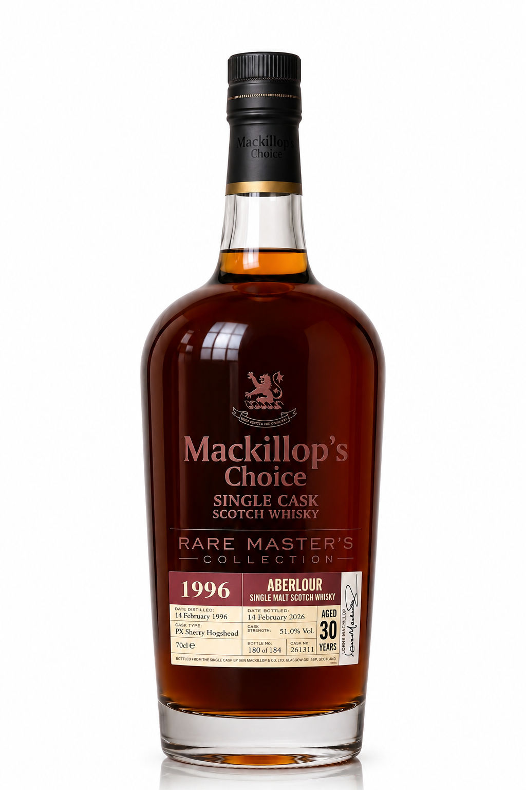
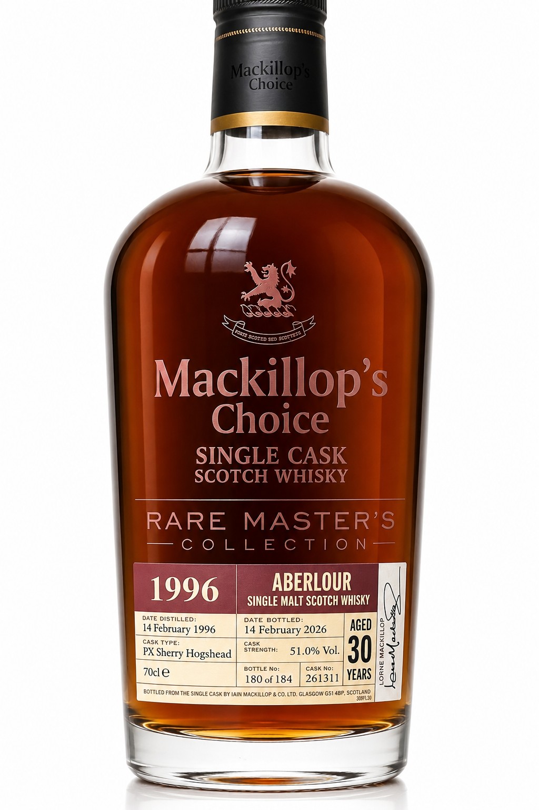
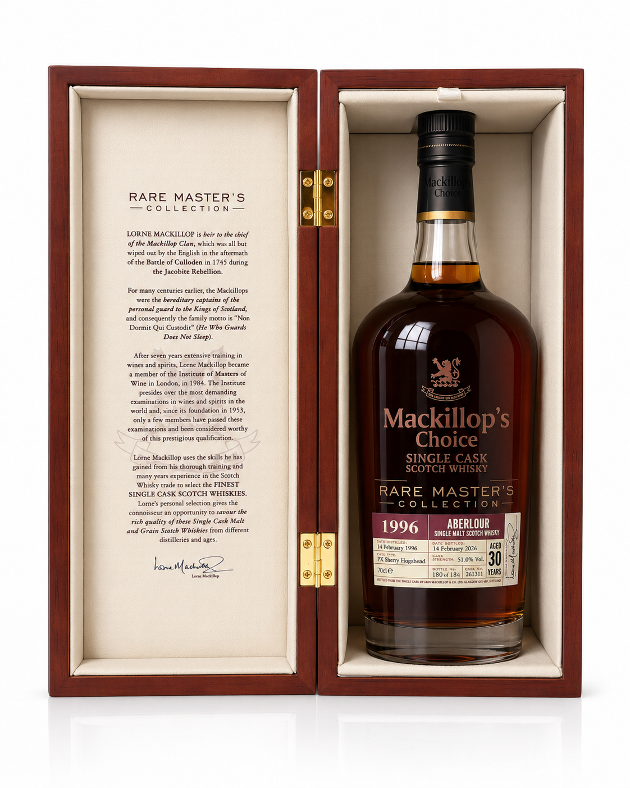

# 威熏邑境自媒体内容生成系统

**威熏邑境自媒体内容生成系统（WXYJ Content System）是威熏邑境品牌专属的 Codex Skill，当前主要服务“马克瑞普之选亚伯乐1996年单桶”在小红书、抖音和视频号上的持续内容创作。** 它把该产品的事实、包装文案、品牌故事、17张高清参考图、选题、标题、正文、Tag、AIGC 图片/视频提示词、发布审核和内容归档组织成一个可重复执行的工作流。

当前版本：`2.3.1`<br>
Skill ID：`wxyj-content-system`<br>
GitHub Repository ID：`wxyj-content-system`

## 专属定位

- 品牌：威熏邑境。
- 业务范围：威士忌品牌在中国市场的销售、运营与宣传。
- 当前核心产品：马克瑞普之选亚伯乐1996年单桶。
- 当前核心平台：小红书、抖音、视频号。
- 当前目标：先建立账号影响力、专业认知与粉丝规模，再承接私信、企微、店铺和线下品鉴。
- 内容原则：所有威士忌知识、节日表达和热点切入都必须回到当前产品，不经营脱离产品的泛知识账号。

## 适合谁

- 威熏邑境自营内容、品牌、销售与品鉴活动团队；
- 负责马克瑞普之选亚伯乐1996年单桶中国市场传播的运营人员；
- 需要持续生成小红书图文、抖音脚本和视频号内容的 AIGC 创作者；
- 需要统一产品事实、参考图、标题、正文、标签、首评、提示词和媒体归档的协作人员。

## 当前核心产品知识

| 字段 | 已确认信息 |
| --- | --- |
| 产品 | 马克瑞普之选亚伯乐1996年单桶 |
| 产区 | 苏格兰斯佩塞 |
| 入桶 / 装瓶 | 1996年2月14日 / 2026年2月14日 |
| 酒龄 | 30年 |
| 桶型 / 桶号 | PX Sherry Hogshead / 261311 |
| 酒精度 / 容量 | 51% ABV / 70cl（700ml） |
| 总装瓶数 | 184瓶 |
| 当前标准样瓶号 | 180 of 184 |
| 标示价格 | 7888元 |
| 经营身份 | 运营方自行进口并单桶装瓶，具备合法销售与宣传授权 |
| 核心传播词 | 亚伯乐30年、30年、2月14日、情人节 |

完整知识体系已经内置：

- [产品事实、推导、团队品鉴与发布前核对](references/product-facts.md)
- [木盒品鉴词、礼盒内页故事与传播边界](references/product-packaging-copy.md)
- [品牌定位、受众、栏目与内容比例](references/brand-positioning.md)
- [产品参考图选择和生成约束](references/visual-asset-library.md)

## 内置17张产品参考图

仓库内置酒瓶5张、木质礼盒5张、白色外包装7张，共17张 AIGC 高清产品参考图。原始 PNG、中文角度文件名和 SHA-256 均被保留，可直接用于小红书逐页生图以及抖音、视频号逐镜生产。

<p>
  
  
  
</p>

- [查看17张参考图](assets/products/mackillops-choice-aberlour-1996/reference-images/)
- [查看资产清单、用途与文件哈希](assets/products/mackillops-choice-aberlour-1996/asset-manifest.json)

这些图片属于威熏邑境受限品牌资产，不适用 Apache-2.0。它们是 AIGC 高清参考图，不是消费者事实证据；发布事实仍应以真实酒标、实物照片、报关和溯源文件为准。

## 系统能生成什么

| 模块 | 输出 |
| --- | --- |
| 选题 | 母题、钩子、爆款公式、受众需求、事实锚点、热度与风险 |
| 小红书 | 标题 A/B、动态页数、逐页提示词、图片内文字、正文、Tag、首评、QA |
| 抖音 | 标题、3秒钩子、逐镜分镜、旁白、字幕、简介、Tag、置顶评论 |
| 视频号 | 标题、5秒观看理由、逐镜分镜、描述、Tag、首评、朋友圈转发文案 |
| AIGC | 参考图职责、完整提示词、负面提示词、产品锁定、局部重绘与QA |
| 内容管理 | 标准运行目录、媒体命名、版本保留、发布前自动校验 |
| 运营闭环 | 评论、私信、企微、店铺、品鉴会与数据复盘 |

生成图片只是一个环节。系统要求每套内容同时具备可直接发布的标题、正文/描述、平台标签、首评或置顶评论、CTA 与 AIGC 披露。

## 核心场景

### 小红书图文生成

根据内容信息量选择3–8页，而不是固定生成8页。第1页承担封面职责，后续页按证据、解释、判断、总结和互动分工。生成前先锁定逐页 `view_id`，相邻页面不得使用相同机位；每张首轮原生成文件必须直接通过精确3:4画幅检查，不用裁切或拉伸补救。

### 抖音短视频脚本

生成25–60秒竖屏脚本，包含3秒钩子、逐镜画面、旁白、字幕、封面字、简介、话题标签和置顶评论。

### 视频号内容策划

生成30–90秒完整叙事，强调年份、纪念日、礼赠或品鉴判断，并提供适合朋友圈转发的文案。

### 外部 Seedance 协作

抖音与视频号共用一个原生9:16视频母版。默认采用平台无关的外部 Seedance 工作流：系统为每个镜头选择并复制实际参考图，提供上传顺序、单字段/双字段提示词、通用参数和回传命名；你可在任意支持对应输入模式的平台生成。ChatCut 默认承担可编辑剪辑、字幕、声音与导出，只有当前任务明确授权时才使用其付费视频生成功能。

```text
video-master/
├── external-generation/  # 逐镜任务卡、提示词、参考图
├── incoming/             # 用户回传原件，永不覆盖
├── accepted/             # 验收通过的副本
├── storyboard.md
└── edit-plan.md
```

```powershell
python scripts\create_external_video_handoff.py `
  --run-dir <内容运行目录> `
  --spec <镜头规格.json> `
  --source-root <参考图目录>

python scripts\validate_external_video_return.py `
  <video-master\incoming\镜头.mp4> `
  --shot-dir <video-master\external-generation\SNN-shot-slug>
```

### 威士忌 AIGC 内容

使用真实酒瓶、酒标、桶号、包装和文件作为身份或事实参考；AIGC 负责氛围、解释与视觉表达，不冒充真实酒厂、历史现场或顾客反馈。

## 项目结构

```text
wxyj-content-system/
├── SKILL.md
├── agents/
├── assets/
│   ├── products/
│   │   └── mackillops-choice-aberlour-1996/
│   │       ├── asset-manifest.json
│   │       └── reference-images/  # 17张产品参考图
│   └── templates/
├── references/
├── scripts/
├── examples/
│   ├── content-runs/
│   └── strategy/
├── docs/
├── tests/
├── README.md
├── README.en.md
├── CHANGELOG.md
├── VERSION
├── OPEN_SOURCE.md
└── outputs/
```

仓库根目录就是 Skill 根目录。`SKILL.md`、运行脚本、参考资料和模板均可从根目录直接访问。

## 快速开始

### 1. 安装 Skill

将克隆后的整个仓库目录复制到 Codex Skills 目录。

Windows 默认安装目标：

```text
C:\Users\<用户名>\.codex\skills\wxyj-content-system
```

### 2. 调用

```text
使用 $wxyj-content-system，为马克瑞普之选亚伯乐1996年单桶
生成一套8月1日小红书图文，
同时生成标题A/B、发布正文、Tag、首评、逐页提示词和QA。
```

### 3. 创建标准内容运行包

```powershell
python scripts\create_content_run.py `
  --root outputs `
  --date 2026-08-01 `
  --slug label-reading `
  --product "马克瑞普之选亚伯乐1996年单桶" `
  --platforms xiaohongshu
```

系统创建：

```text
outputs/2026/08/2026-08-01-label-reading/
├── manifest.yaml
├── brief.md
├── sources.md
└── xiaohongshu/
    ├── publish.md
    ├── prompts.md
    ├── qa.md
    └── media/
```

### 4. 验证

```powershell
python scripts\validate_product_assets.py

python scripts\validate_content_run.py `
  outputs\2026\08\2026-08-01-label-reading
```

产品资产校验器会检查17张参考图的数量、登记状态与 SHA-256；内容运行校验器会检查目录、文件名、标题、正文、Tag、首评、CTA、AIGC披露和高风险表达。

## 小红书发布包标准

每个 `xiaohongshu/publish.md` 必须包含：

1. 主标题；
2. 备选标题；
3. 一句话钩子；
4. 完整发布正文；
5. 5–10个聚焦话题标签；
6. 首评；
7. CTA；
8. AIGC与事实披露。

详细规范参见：

- [内容交付契约](docs/content-contract.md)
- [输出目录](docs/output-structure.md)
- [文件命名](docs/naming-convention.md)
- [合规边界](docs/compliance.md)

## 文件命名示例

```text
20260801-xhs-label-reading-p01-cover-v01.png
20260801-xhs-label-reading-p02-dates-v01.png
20260801-xhs-label-reading-p03-cask-data-v02.png
20260801-xhs-label-reading-p00-qa-overview-v01.png
```

不使用“最终版”“最新版”“新图2”等无法追踪的文件名。视觉发生变化时增加 `vNN`，不覆盖已发布版本。

## 常见问题

### 这只是图片生成 Skill 吗？

不是。图片只是媒体资产。系统同时生成选题、标题、正文、Tag、首评、CTA、提示词、分镜、QA和内容目录。

### 是否固定每次生成8张小红书图片？

不固定。轻内容通常3–4页，标准内容5–6页，只有信息量足够的深度主题使用7–8页。

### 是否可以使用同一张酒瓶参考图完成全部页面？

不建议。系统根据页面功能选择正面、45度、酒标、礼盒或文件参考，同时使用统一视觉母版保持连续性。

### 如何避免一套图里的酒瓶忽胖忽瘦？

完整正面酒瓶统一以 `酒瓶-正面.png` 为唯一几何母版，并检查瓶身宽高、瓶盖宽度、瓶肩位置和5%容差。五页套图默认最多出现2页完整酒瓶；其余页面使用酒标证据窗口、礼盒、文件或风味静物，减少无意义的产品重绘。

### 如何避免多页重复强调桶号或混入废片？

每页先登记唯一 `primary_fact_id`，桶号只允许一个主视觉事实页。生成版本在QA中标记为 `working`、`rejected` 或 `publish`，发布清单和缩略图总览只引用 `publish` 文件。

### 是否会把AIGC图片当成产品证据？

不会。产品事实应由实物酒标、真实产品、进口与溯源材料支撑；AIGC只承担创意表达，并需要披露。

### 能否用于其他威士忌产品？

当前 Skill 默认且主要服务马克瑞普之选亚伯乐1996年单桶。未来产品只有在威熏邑境明确提供并核验产品卡、素材和传播边界后才接入，不会自动把通用威士忌内容替代当前产品。

## 文档与维护

- [开始使用](docs/getting-started.md)
- [标准内容示例](examples/README.md)
- [版本策略](docs/versioning.md)
- [更新记录](CHANGELOG.md)
- [开放范围](OPEN_SOURCE.md)
- [参与贡献](CONTRIBUTING.md)

## 许可

代码、模板与公开文档使用 Apache-2.0。威熏邑境名称、商标、产品图片、包装设计、授权文件及第三方平台标识不因本许可而授权。详见 [OPEN_SOURCE.md](OPEN_SOURCE.md)。
